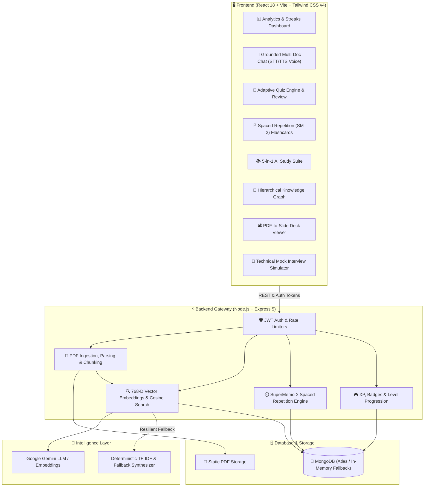

# 🎓 AI Learning Assistant & Smart Study Companion

> **An Intelligent, Full-Stack Educational Platform** powered by **Retrieval-Augmented Generation (RAG)**, **Dense Vector Embeddings**, **Spaced Repetition (SuperMemo-2)**, **Multi-Document Intelligence**, **Voice Interaction**, and **Gamified Analytics**.

[](https://react.dev/)
[](https://vitejs.dev/)
[](https://tailwindcss.com/)
[](https://nodejs.org/)
[](https://expressjs.com/)
[](https://www.mongodb.com/)
[](https://ai.google.dev/)
[](LICENSE)

---

## 🌟 Overview

The **AI Learning Assistant** transforms complex study materials (PDFs, lectures, technical documentation) into an interactive, high-retention learning experience. Built with a high-performance **MERN** architecture and modern **RAG pipeline**, the platform equips students, researchers, and engineers with instant document synthesis, adaptive quizzes, memory-backed flashcards, AI mock interviews, and automated study plans.

---

## 🏛️ System Architecture



---

## 🚀 Key Features

### 1. 🔍 Retrieval-Augmented Generation (RAG)
- **Vector-Based Semantic Search**: Automatically splits ingested PDFs into discrete context chunks and indexes them using dense vector representations.
- **Cosine Similarity Ranking**: Extracts top-ranked document context to answer questions with zero hallucination.
- **Grounded Source Citations**: Every AI response includes clickable page and section citations with instant excerpt drawers.
- **Resilient Fallback Engine**: Built-in deterministic TF-IDF feature hashing ensures 100% uptime even when external API rate limits occur.

### 2. 📚 Multi-Document Intelligence & Comparison
- **Cross-Document Querying**: Converse across individual or multiple uploaded documents simultaneously.
- **Side-by-Side Comparison Matrix**: Compare two documents side-by-side to analyze scope, similarities, and methodologies.
- **Contradiction & Divergence Detector**: Automatically detects conflicting formulas, terminology, or assumptions between sources.

### 3. 🧠 Smart Flashcards with Spaced Repetition (SM-2)
- **SuperMemo-2 Algorithm**: Dynamically calculates memory decay and review intervals based on card ratings:
  - 🔴 **Hard**: Interval reset to 1 day (Ease factor adjusted).
  - 🟡 **Good**: Scheduled for 3-day retention review.
  - 🟢 **Easy**: Scheduled for 7+ days (Mastered status).
- **Mastery Ring Tracker**: Real-time visualization of deck mastery percentages.
- **Starred Cards Filter**: Star difficult concepts for targeted high-yield review sessions.

### 4. 📝 Adaptive Quiz & Weak-Topic Diagnostics
- **Configurable Difficulty & Counts**: Easy, Medium, and Hard question tiers with randomized answer shuffling.
- **In-Depth Answer Explanations**: Review question breakdowns, model solutions, and document references.
- **Weak-Topic Detection**: Automatically flags topics scoring `<60%` and generates 1-click **Diagnostic Quizzes** to close retention gaps.

### 5. 📖 5-in-1 AI Revision & Study Suite
Generate specialized study assets tailored to any learning style:
1. **Summary & Executive Briefing**: High-level abstract of core principles.
2. **Short Notes**: Bulleted memory triggers for fast scanning.
3. **Exam High-Yield Notes**: High-probability exam topics and marking criteria.
4. **Key Definitions & Formulas**: Mathematical proofs, code snippets, and formal theorems.
5. **Interview & Exam FAQs**: Model questions and comprehensive answers.

### 6. 🗺️ Concept Knowledge Graph & Mind Map
- Interactive, collapsible tree view of chapters, topics, and sub-concepts.
- Visual breakdown of dependencies and applications.
- One-click Markdown copy and export.

### 7. 💼 Technical Mock Interview Mode
- Role-specific interview simulations (e.g. *Full Stack Developer*, *DevOps Engineer*, *Data Scientist*) across Junior, Mid, and Senior difficulty levels.
- Real-time AI evaluation: Detailed scoring (1–10), constructive critique, missing keywords, and ideal responses.
- Final Readiness Scorecard with bonus XP rewards upon completion.

### 8. 🎙️ Hands-Free Voice Assistant
- **Speech-to-Text (STT)**: Ask questions verbally using standard browser Web Speech Recognition.
- **Text-to-Speech (TTS)**: Listen to synthesized AI responses with smooth voice playback.

### 9. 📽️ PDF-to-Presentation Slide Deck Generator
- Automatically converts document sections into an executive presentation deck.
- Includes slide navigation, presenter speaker notes, key takeaways, and fullscreen presentation mode.

### 10. 📅 Dynamic 7-Day AI Study Planner
- Automatically schedules a personalized Monday-to-Sunday study curriculum based on uploaded materials and quiz performance.
- Interactive daily task checkboxes with live progress tracking.

### 11. 🎮 Gamification & Analytics Dashboard
- **XP Progression & Levels**: Earn XP on document uploads (+25), quizzes (+50), flashcard reviews (+10), and interviews (+100).
- **Milestone Badges**: Unlock achievements (*First Step*, *Quiz Whiz*, *Card Scholar*, *Job Ready*, *On Fire* streak).
- **Study Analytics**: Track total study time, score trends over time, topic mastery, and activity history.

### 12. 🖨️ 1-Click PDF & Printable Export
- Print-optimized CSS (`@media print`) for clean, distraction-free PDF generation of notes, quiz results, flashcard sheets, and comparison matrices.

---

## 🛠️ Technology Stack

| Layer | Technology | Description |
| :--- | :--- | :--- |
| **Frontend UI** | **React 18** | High-performance interactive UI components |
| **Build Tool** | **Vite 5** | Lightning-fast HMR and bundling |
| **Styling** | **Tailwind CSS v4** | Modern utility-first styling with custom dark/light themes |
| **Icons & Motion** | **Lucide React & Framer Motion** | Crisp iconography and smooth UI micro-animations |
| **Backend** | **Node.js & Express 5** | RESTful API server with ES Module support |
| **Database** | **MongoDB & Mongoose 9** | Flexible schema persistence with auto In-Memory fallback |
| **AI / Embeddings**| **Google Gemini API** | Multi-turn reasoning, embeddings, and context synthesis |
| **Security** | **JWT, Bcrypt.js, Helmet** | Token-based authentication and rate limiting |

---

## 📁 Project Structure

```text
ai-learning-assistant/
├── backend/
│   ├── config/             # Database connection & in-memory MongoDB fallback
│   ├── controllers/        # Business logic (Auth, AI, Documents, Flashcards, Quizzes, Progress)
│   ├── middleware/         # Auth guard, rate limiters, file uploads & error handler
│   ├── models/             # Mongoose schemas (User, Document, Flashcard, Quiz, StudyPlan, etc.)
│   ├── routes/             # RESTful API route declarations
│   ├── uploads/            # Uploaded PDF document storage
│   ├── utils/              # RAG, Gemini AI service, embeddings, SRS, and gamification logic
│   ├── package.json        # Backend dependencies & scripts
│   └── server.js           # Server entry point
├── src/
│   ├── assets/             # Images and static assets
│   ├── Components/         # Modular UI components (Auth, Chat, Common, Documents, Quizzes, etc.)
│   ├── context/            # Global React Contexts (AuthContext, ThemeContext)
│   ├── pages/              # Application views (Dashboard, Chat, Documents, Flashcards, Interview, etc.)
│   ├── utils/              # API path constants, Axios interceptor, and helper functions
│   ├── App.jsx             # React Router routing & layout wrapper
│   ├── index.css           # Tailwind CSS v4 & theme definitions
│   └── main.jsx            # Frontend entry point
├── public/                 # Public web assets
├── verify_all_features.js  # Automated end-to-end feature verification suite
├── vite.config.js          # Vite configuration
└── package.json            # Frontend dependencies & scripts
```

---

## ⚡ Quick Start

### 1. Prerequisites
- **Node.js**: v18.0.0 or higher
- **npm**: v9.0.0 or higher
- **Google Gemini API Key**: Obtainable from [Google AI Studio](https://aistudio.google.com/) *(Optional: offline fallback is available)*
- **MongoDB**: MongoDB Atlas connection URI or local MongoDB *(Optional: automatically defaults to an in-memory database if no URI is provided)*

### 2. Clone and Install Dependencies

```bash
# Clone the repository
git clone https://github.com/your-username/ai-learning-assistant.git
cd ai-learning-assistant

# Install frontend dependencies
npm install

# Install backend dependencies
cd backend
npm install
cd ..
```

### 3. Configure Environment Variables

Create `.env` inside the `backend/` directory:

```env
# Server Configuration
PORT=8000
NODE_ENV=development

# Database (Leave empty or omit to use zero-config in-memory MongoDB)
MONGO_URI=mongodb+srv://<username>:<password>@cluster.mongodb.net/ai_learning_assistant

# Authentication
JWT_SECRET=your_super_secret_jwt_key_at_least_32_characters
JWT_EXPIRES_IN=7d

# Google Gemini AI
GEMINI_API_KEY=your_gemini_api_key_here

# Upload Limits (in bytes, default: 10MB)
MAX_FILE_SIZE=10485760
```

> 💡 **Zero-Config Notice**: If no `MONGO_URI` is supplied, the backend seamlessly launches an automated **in-memory MongoDB server** (`mongodb-memory-server`), allowing immediate local development without setting up database clusters.

### 4. Run the Project

#### Development Mode:
Open two terminal windows:

```bash
# Terminal 1: Start Backend API (Port 8000)
cd backend
npm run dev

# Terminal 2: Start Frontend Application (Port 5173)
npm run dev
```

Now open **`http://localhost:5173`** in your browser!

---

## 🔌 API Reference Overview

| Module | Method | Endpoint | Description |
| :--- | :--- | :--- | :--- |
| **Auth** | `POST` | `/api/auth/register` | Register new user account |
| **Auth** | `POST` | `/api/auth/login` | Authenticate user & issue JWT |
| **Auth** | `GET` | `/api/auth/profile` | Get current user profile & XP stats |
| **Documents** | `POST` | `/api/documents/upload` | Upload and process PDF file |
| **Documents** | `GET` | `/api/documents` | List all uploaded documents for user |
| **Documents** | `GET` | `/api/documents/:id` | Get document details & text chunks |
| **Documents** | `DELETE`| `/api/documents/:id` | Delete document and associated assets |
| **AI** | `POST` | `/api/ai/chat` | RAG single-document chat with citations |
| **AI** | `POST` | `/api/ai/multi-chat` | Multi-document grounded chat |
| **AI** | `POST` | `/api/ai/compare-documents` | Compare two documents side-by-side |
| **AI** | `POST` | `/api/ai/generate-notes` | Generate 5-in-1 study notes suite |
| **AI** | `POST` | `/api/ai/generate-mindmap` | Generate concept tree / knowledge map |
| **AI** | `GET` | `/api/ai/presentation/:id` | Generate presentation slide deck |
| **AI** | `POST` | `/api/ai/interview/start` | Initialize AI technical mock interview |
| **AI** | `POST` | `/api/ai/interview/answer` | Submit interview response for evaluation |
| **Flashcards**| `GET` | `/api/flashcards/:docId` | Retrieve flashcards for a document |
| **Flashcards**| `POST` | `/api/flashcards/:id/review-srs` | Submit SM-2 review rating (Hard/Good/Easy)|
| **Flashcards**| `POST` | `/api/flashcards/:id/star` | Toggle star on flashcard |
| **Quizzes** | `POST` | `/api/ai/generate-quiz` | Generate adaptive quiz |
| **Quizzes** | `POST` | `/api/quizzes/:id/submit` | Submit quiz answers and calculate score |
| **Progress** | `GET` | `/api/progress/dashboard` | Get overall analytics, streaks, and XP |
| **Progress** | `GET` | `/api/progress/study-plan` | Retrieve weekly study schedule |

---

## 🧪 Testing & Verification

Run the comprehensive end-to-end test suite to verify authentication, PDF ingestion, RAG chat, flashcards, and quizzes:

```bash
# Ensure the backend server is running on port 8000, then run:
node verify_all_features.js
```

---

## 🤝 Contributing

Contributions, issues, and feature requests are welcome!
1. Fork the repository
2. Create your feature branch (`git checkout -b feature/AmazingFeature`)
3. Commit your changes (`git commit -m 'Add some AmazingFeature'`)
4. Push to the branch (`git push origin feature/AmazingFeature`)
5. Open a Pull Request

---

## 📄 License

Distributed under the **MIT License**. See `LICENSE` for more information.
